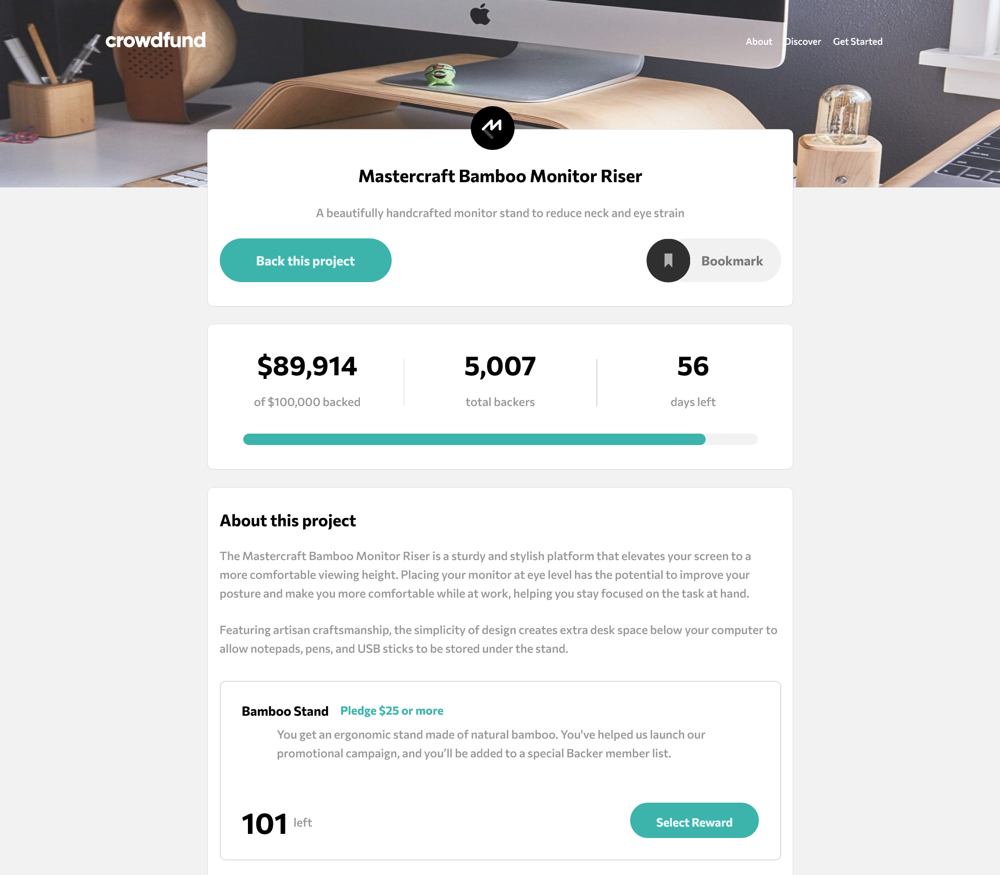

# Frontend Mentor - Crowdfunding product page solution

This is a solution to the [Crowdfunding product page challenge on Frontend Mentor](https://www.frontendmentor.io/challenges/crowdfunding-product-page-7uvcZe7ZR). Frontend Mentor challenges help you improve your coding skills by building realistic projects.

## Table of contents

- [Overview](#overview)
  - [The challenge](#the-challenge)
  - [Screenshot](#screenshot)
  - [Links](#links)
- [My process](#my-process)
  - [Built with](#built-with)
  - [What I learned](#what-i-learned)
  - [Continued development](#continued-development)
- [Author](#author)
- [Acknowledgments](#acknowledgments)

## Overview

### The challenge

Users should be able to:

- View the optimal layout depending on their device's screen size
- See hover states for interactive elements
- Make a selection of which pledge to make
- See an updated progress bar and total money raised based on their pledge total after confirming a pledge
- See the number of total backers increment by one after confirming a pledge
- Toggle whether or not the product is bookmarked

### Screenshot

### Links

- Solution URL: https://www.frontendmentor.io/solutions/crowdfunding-product-page-n0BAd6V8ri
- Live Site URL: https://crowdfunding-project-page.netlify.app

## My process

### Built with

- Semantic HTML5 markup
- Flexbox
- Mobile-first workflow
- Vanilla CSS - For styles
- [React](https://reactjs.org/) - JS library

### What I learned

This was my first 'big' project.
First of all, I practiced my HTML and CSS knowledge, which at the moment was kind of relegated to the back because in every tutorial I had done, the design was given, so I never had to think much about it. This project is a complete website, with Modals, buttons, progress bars, you name it, and it was quite challenging to keep it responsive.
I learn that styling the elements of a full website with just vanilla CSS can get quite messy and you really need to think of new names for IDs and classes, which is not fun at all. I will learn Styled Components for my next projects.
Second, I got to keep on honing my JS and React knowledge. I got better at designing the whole framework of the page, deciding where should the components be settled and how to pass props to them.
The component Cards gave me some headaches because I had two .maps on the object that contains the list of pledges, so I learned to pass the props on both .maps not just one as I first did.
It was also very challenging to build the EnterPledge component, the one that contains the form that the client is going to fill for making the pledge. I felt so proud of myself when I could make it.
Last but no least, I lost the fear of programming on my own, without the guide of the voice behind the tutorials. It gave me the confidence I needed to start doing real programming once and for all, I loved it!

### Continued development

As I said in the previous section, thanks to this project I realized how difficult is to style a website with just vanilla CSS. In the future I will be using a better styling approach, be it SASS or Styled Components.
I am also planning to expand my Typescript knowledge and make a project with it.

## Author

- Frontend Mentor - [@jorge-eche](https://www.frontendmentor.io/profile/jorge-eche)
- Twitter - [@CokoEche](https://twitter.com/CokoEche)
- LinkedIn - [@jorgeecheverria-dev/] (https://www.linkedin.com/in/jorgeecheverria-dev/)

## Acknowledgments

I thank Frontend Mentor to the opportunity it gives to aspiring developers to practice their JS skills without having to spend our precious time in designing the website.
I get the feeling that this is not going to be the last challenge I will do with you!
